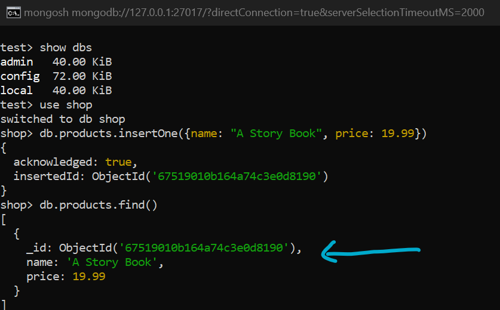
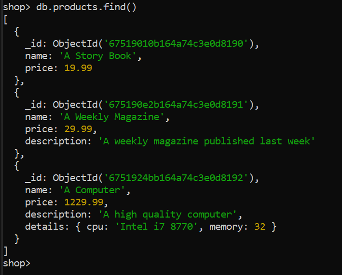
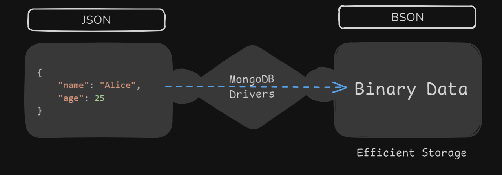

# MongoDB Diary

### This repository contains my notes and code from my MongoDB learning journey.

## Contents:

1. [Get Started with Mongosh](#connect-to-the-mongodb-instance)

    1.1 [CRUD Operations & MongoDB](#crud-oeprations--mongodb)

    1.2. [Find Concepts and exmaples](#-find-concepts-and-examples)

    1.3. [forEach](#foreach)

    1.4. [Projection](#projection)

2. [Schemas and Relations](#schemas-and-relations)

    2.1. [Reset Databases](#reste-databases)


## Connect to the MongoDB instance
```
mongosh
```

or

```
"C:\Program Files\MongoDB\mongosh.exe"
```

NOTE: 📝 In previous version (older than 5.0), mongo.exe need to be executed. But we don’t need to manually run mongo.exe anymore because the MongoDB Shell (mongosh) has replaced the legacy mongo.exe as the default shell.

### Get Started
- View the default database.
```
show dbs
```
- Connect the databse using "use" command.
```
use shop
```
- Create a new collection in the shop database.
- Here, ```db``` refers to the selected database which is shop, ```products``` is the new collection which is to be created, and ```insertOne``` command is used for inserting a new data.
- A pair of curly braces inside the insertOne command refers to the JSON object.

```javaScript
db.products.insertOne({name: "A Story Book", price: 19.99})
```

- Now, run the "find()" command to see all the data in the products.

```javaScript
db.products.find()
```

- MongoDB automatically generates a unique id.



- The pretty() method in MongoDB is used to format the output of the find() query in a more readable and well-structured JSON-like format.
```javaScript
db.products.find().pretty()
```

NOTE:📝
In mongosh (MongoDB Shell), pretty() isn't always necessary because the output is automatically formatted for better readability.

### Add nested field "details" in the products collection.
```javaScript
db.products.insertOne({name: "A Computer", price: 1229.99, description: "A high quality computer", details: { cpu: "Intel i7 8770", memory: 32}})
```



### Shell vs Drivers
| MongoDB Shell | MongoDB Drivers |
| ---- | ---- |
| A command-line tool for directly interacting with MongoDB. Used for querying, database administration, and testing. It's ideal for manual operations and uses JavaScript for commands. | Programming language-specific libraries (e.g., Node.js, Python, Java) that allow applications to interact with MongoDB programmatically. Used for building and automating database interactions in apps. |


| **Aspect**              | **MongoDB Shell**                          | **MongoDB Drivers**                          |
|-------------------------|--------------------------------------------|----------------------------------------------|
| **Purpose**             | Manual interaction with MongoDB            | Programmatic interaction from an application |
| **Usage**               | Querying, debugging, admin tasks           | Building apps to interact with MongoDB       |
| **Environment**         | CLI (command line)                         | Application environment (e.g., backend code) |
| **Language**            | JavaScript (shell commands)                | Language of the app (e.g., Python, Java)     |
| **Best For**            | Quick queries, testing, troubleshooting    | Application development and automation       |
| **Installation**        | Comes with MongoDB installation            | Installed separately for the specific language |
| **Connection Lifespan** | Temporary (used while running the shell)   | Persistent (maintained for app functionality) |
| **Performance**         | Manual, one-time operations                | High-performance API for automated tasks     |


### JSON vs BSON
| **Aspect**          | **JSON (JavaScript Object Notation)**               | **BSON (Binary JSON)**                        |
|----------------------|-----------------------------------------------------|-----------------------------------------------|
| **Definition**       | Text-based data format for representing objects.    | Binary-encoded format optimized for MongoDB.  |
| **Usage in MongoDB** | Used for data exchange and API interactions.        | Used internally for data storage and querying. |
| **Format**           | Human-readable text format.                         | Machine-readable binary format.               |
| **Speed**            | Slower to parse due to text-based nature.           | Faster to parse due to binary representation. |
| **Size**             | Larger in size as it's plain text.                  | Smaller and more efficient due to compression.|
| **Data Types**       | Limited to standard JSON types (e.g., string, number). | Supports additional types (e.g., Date, ObjectId, Binary). |
| **Readability**      | Easily readable by humans.                          | Not directly human-readable.                  |
| **Efficiency**       | Less efficient for storage and querying.            | Optimized for MongoDB performance.            |
| **Example**          | `{ "name": "Alice", "age": 25 }`                    | Binary representation of the same object.     |



---

[Go to Top ⬆️ ](#contents)

---


## CRUD operations & MongoDB

### Create: 
- ```insertOne(data, options)``` is used to insert some data into a collection. It also allows us to pass some options along with data.
- with ```insertMany(data, options)```, we can insert more than one data at a time.

- Pass an array of JSON data to insertMany()
```JavaScript
db.flightData.insertMany([
  {
    "departureAirport": "MUC",
    "arrivalAirport": "SFO",
    "aircraft": "Airbus A380",
    "distance": 12000,
    "intercontinental": true
  },
  {
    "departureAirport": "LHR",
    "arrivalAirport": "TXL",
    "aircraft": "Airbus A320",
    "distance": 950,
    "intercontinental": false
  }
]);

```

### Read
- The data can be read with the help of ```find(filter, options)``` method.
- ```findOne(filter, options)``` will retrieve the first matching document.

- find() with arguments

```javaScript
db.flightData.find({departureAirport: 'MUC'})
```

### Update
- The data can be updated using ```updateOne(filter, data, options)``` method
- ```updateMany(filter, data, options)```to update many data at a time.
- Here, the argument "filter" is passed to find the data which needs to be changed.
- ```replaceOne(filter, data, options)``` is used for replacing the entire document with a new one.

```javaScript
db.flightData.updateMany({}, {$set : {marker: "toDelete"}})
```

### Delete
- We can delete one or many data using ```deleteOne(filter, options)``` or ```deleteMany(filter, options)```.

```javaScript

db.flightData.deleteMany({marker: "toDelete"})


db.collectionName.deleteOne({keyName: "value"})

or
//to delete many, we should insert a common key in all the data
db.collectionName.deleteMany({commonKeyName: "common value"})

```

---

[Go to Top ⬆️ ](#contents)

---

### 🔎 find() concepts and examples

**Q. Find all flights with a distance > 10000 KM in flightData.**

```javaScript
db.flightData.find({distance: {$gt : 10000}})
```

- Here, ```$gt``` (Greater Than) is a query operator used to filter documents where a field's value is greater than a specified value.
- This query returns all documents where the distance field is greater than 1000.


**find() and the cursor object**
- ```find()``` command doesn't give all the data but a cursor object. It doesn't give an array of all the documents in a collection. 
- It is actually make sense because a collection can ve very big. So instead if sending a huge data, it gives  back a cursor object which is an object with a lot of metadata behind it that due to which we can loop through the results.
- The ```it``` command does the same.

- However, we can view all the data using "toArray()" method.

```
db.passengers.find().toArray()
```

---

[Go to Top ⬆️ ](#contents)

---

### forEach()
- It can be used to loop through the cursor object.

```javaScript
db.passengers.find().forEach(passengerData => {printjson(passengerData)})
```

NOTE: passenger data output is in "dummy-data" folder.

### Projection
- It lets us include or exclude specific fields in query results, reducing data load and improving efficiency.
- By default, all fields are returned, but projection fetches only the fields you need.

```javaScript
db.passengers.find({}, {name: 1})
```
- The above query uses projection to filter out only the name.
- { name: 1 }: Includes the name field in the query result.
- Default Behavior: MongoDB includes the _id field automatically unless explicitly excluded (_id: 0).

```javaScript
db.passengers.find({}, {name: 1, _id: 0})
```

📝 Note: Projection is conceptually  smiliar to ```Select``` statement in SQL to specify the fields you want to retrieve from a table.

Advantage:
- Increases query efficiency.
- Reduces memory and network overhead.
- Simplifies data handling.
- Enhances security by filtering out unnecessary fields.

---

[Go to Top ⬆️ ](#contents)

### Embedded Document:
- In MongoDB, embedded documents are documents within other documents (nesting).
- Allows nesting upto 100 of documents.
- Maximum size of the doucment is 16 mb.
- Instead of creating separate collections for related data, we can store related information inside a single document.
- This allows you to model data hierarchies in a natural way.

**Lets update the flightData with nested document**
```javaScript

flightData> db.flightData.updateMany({}, {$set: {status: {description: "on-time", lastUpdate: "1 hour ago"}}})

```
<details>
<summary>OUTPUT</Summary>

```javaScript
[
  {
    _id: ObjectId('6761d05a963d46e6510d8190'),
    departureAirport: 'MUC',
    arrivalAirport: 'SFO',
    aircraft: 'Airbus A380',
    distance: 12000,
    intercontinental: true,
    status: { description: 'on-time', lastUpdate: '1 hour ago' }
  },
  {
    _id: ObjectId('6761d05a963d46e6510d8191'),
    departureAirport: 'LHR',
    arrivalAirport: 'TXL',
    aircraft: 'Airbus A320',
    distance: 950,
    intercontinental: false,
    status: { description: 'on-time', lastUpdate: '1 hour ago' }
  },
  {
    _id: ObjectId('6761d0ad963d46e6510d8192'),
    departureAirport: 'TXL',
    arrivalAirport: 'LHR',
    distance: 700,
    intercontinental: false,
    status: { description: 'on-time', lastUpdate: '1 hour ago' }
  }
]
```

</details>

**Arrays in Documents**
- we can also store an array inside a document.
- In the passenger database, lets add a nested document having an array of hobbies.

```javaScript
passengers> db.passengers.updateOne({name: 'Albert Twostone'}, {$set: {hobbies: ["Reading", "Cooking"]}})
```

<details>
<summary>OUTPUT</Summary>

```javaScript
[
  {
    _id: ObjectId('676466ddca4a7a43170d81a3'),
    name: 'Albert Twostone',
    age: 68,
    hobbies: [ 'Reading', 'Cooking' ]
  }
]
```

</details>


#### Accessing Data ####

- Get the passenger named "Albert Twostone" from the passengers db.

```javaScript
db.passengers.find({name: 'Albert Twostone'})
```

**OUTPUT**
```javaScript
[
  {
    _id: ObjectId('676466ddca4a7a43170d81a3'),
    name: 'Albert Twostone',
    age: 68,
    hobbies: [ 'Reading', 'Cooking' ]
  }
]
```

- Get the "hobbies" of the passenger named "Albert Twostone".

```javaScript
db.passengers.findOne({name: 'Albert Twostone'}).hobbies
```

**OUTPUT**
```javaScript
[ 'Reading', 'Cooking' ]
```

**Find all passengers passengers whose hobby is 'Cooking'**

```javaScript
db.passengers.find({hobbies: "Cooking"})
```

**In flightData, Find all the flights which are "on-time"**

- here, use "." to access the nested document.

```javaScript
db.flightData.find({"status.description": "on-time"})
```


[Go to Top ⬆️ ](#contents)


## Schemas and Relations

### Reste Databases

```javaScript
//load the database first
use databaseName

//drop the database
db.dropDatabase()

//drop the collection in a database
db.myCollection.drop()
```

### 